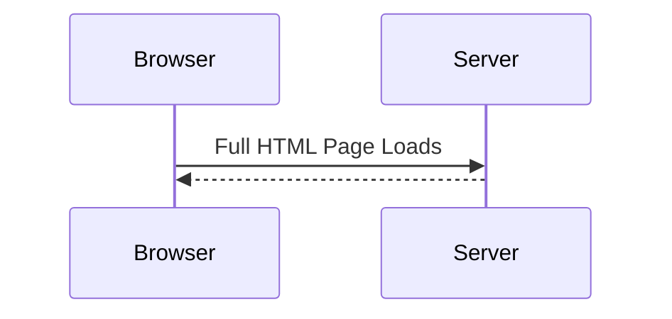
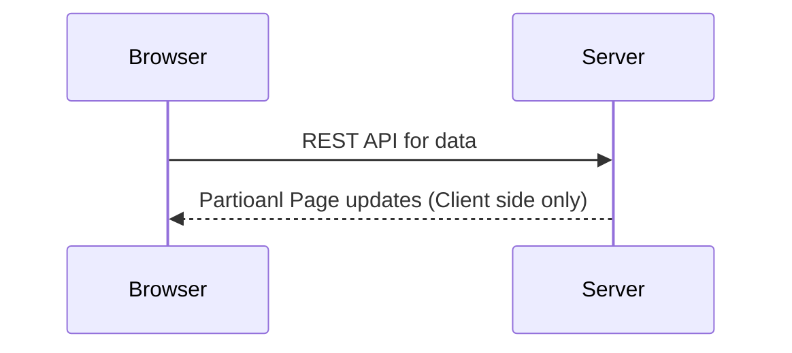

# angular-crash-course
## What is Angular?
* Angular is a framework for building modern single-page application.
* **Official docs tutorials** - www.angular.io

### Traditional Application
* Each user action results in a full HTML page load.

### Single-Page Applicaton
* A web application that is composed of a single page
* Based on user actions, the application page is updated

### Example of Single-Page Applications
* Maps
* Email Applications
* Citi-Bank Customer Service
* Microsoft Xbox portal
* Refer to - www.madewithangular.com

### Features of Angular
* Component-based framework
* Clean seperation of template coding and application logic
* Built-in support for data-binding and dependency injection
* Support responsive web design and modern frameworks such as Bootstrap, Google Material Design (Angular Material) and others

### Key Terms

Term | Definition
-----|-----------
Component | Main player in an Angular application. Hash two parts: <br>1. View for user interface <br>2. Class that contains application logic/event handling for the view
View Template | The user interface for the component <br> Static HTML with dynamic elements
Directive | Adds custom behavior to HTML elements <br>Used for looping, conditionals etc
Service | Helper class that provides desired functionality<br>Retrieving data from a server, performing a calculation, validation etc
Module | A collection of related components, directives, services etc

## Creating an Angular Project
* Angular provides a command-line tool to generate a project
* Generated the starter files to help you bootstrap your project
* http://cli.angular.io
* Project files - http://www.angular.io/guide/file-structure

### Angular CLI
```
# Install Angular CLI

> npm install --location=global @angular/cli@14.0.7
> ng version
> ng help

# Creating New Project

> ng new <project-name>
> ng new my-first-angular-project

# Running the Angular App

> cd <project-name>
> cd my-first-angular-project
> ng serve

# Changing the server port
> ng serve --port 5100

# Creating new component
> ng generate component <component name>
> ng generate component sales-person-list

# Generate a Class
> ng generate class <Class name>
> ng generate class sales-person-list/SalesPerson
```

## Angular - Behind the Scenes
### Loading Angular App
* src/index.html
* src/app/app.component.ts


