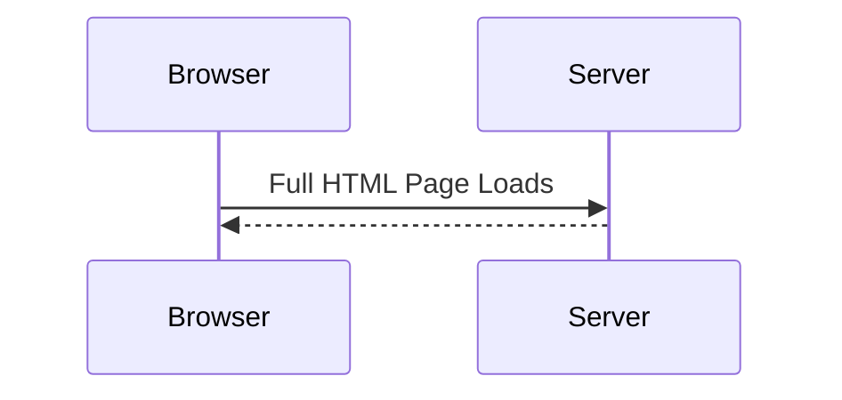
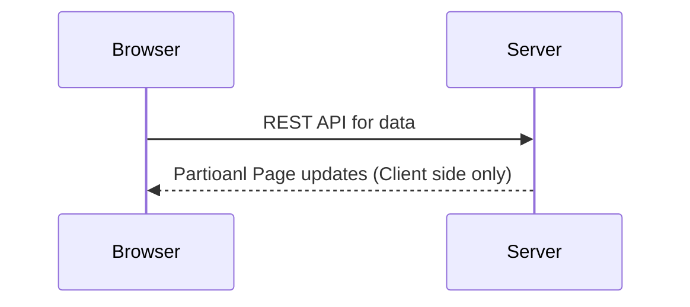

# angular-crash-course
## What is Angular?
* Angular is a framework for building modern single-page application.
* **Official docs tutorials** - www.angular.io

### Traditional Application
* Each user action results in a full HTML page load.

### Single-Page Applicaton
* A web application that is composed of a single page
* Based on user actions, the application page is updated

### Example of Single-Page Applications
* Maps
* Email Applications
* Citi-Bank Customer Service
* Microsoft Xbox portal
* Refer to - www.madewithangular.com
